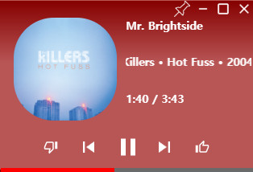

<p align="center">
    
</p>

<h1 align="center">YouTube Music Player for PC</h1>

### To Use

- start

```
~# git clone https://github.com/wow1548/YouTube-Music-Player.git
~# cd YouTube-Music-Player
~# yarn
~# yarn start
```

- Build

```
~# yarn dist
```

### YouTube Music Player


### Miniplayer

### ToDo

- [x] Tray icon
- [x] Background music play
- [x] mini player
- [x] add thumb up, down on miniplayer
